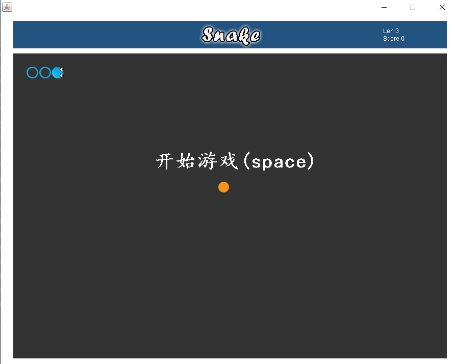

 # java- Greedy Snake  

 ## Background
 I occasionally saw a video of Uncle Mai about the snake eating project. I felt very interesting. If you are interested, you can go to www.bilibili.com to search for "麦叔科普"  
 This project is the reconstruction and optimization of Mai Shu's greedy snake project. I redesign the project structure and class, and pay more attention to OOP knowledge  
 The whole project is very simple, only involves the basic knowledge of javase, which suitable for beginners of Java  
 [zh](README.md)

 ## Install
  ```git
  $ git clone https://github.com/tctctctctc/java-snake.git
  ```

 ## How to use
  After project clone or package download,Using eclipse-->Open project-->Then select the snake folder in the file  
  JDK version 8.0 and above is required
  
 ## Game screenshot
 
  
 ## Contributing
 @tctctctctc


## Contact
  QQ：935706071  
  mail：935706071@qq.com

## Thanks
  Thanks for the game materials and ideas provided by Uncle Mai
   
## License
  [Apache-2.0 License](LICENSE)
  
  
